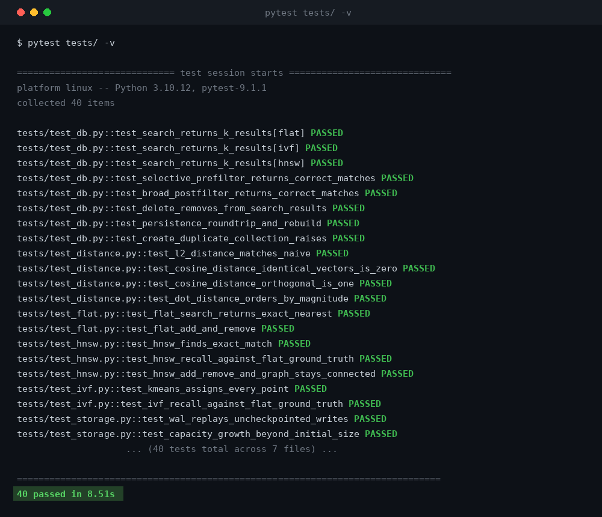
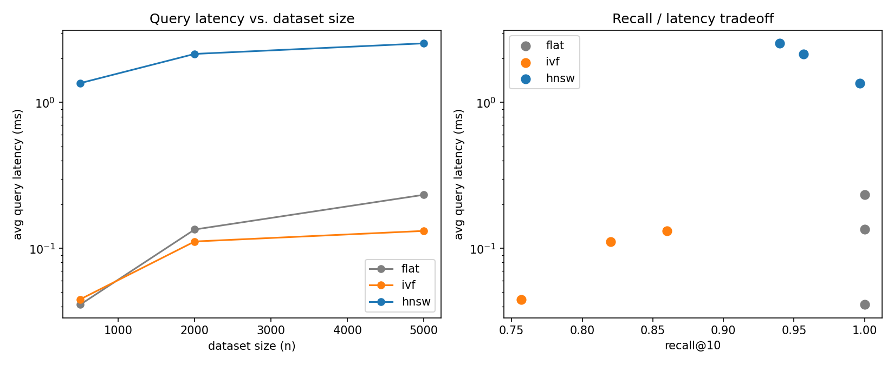

# vectordb

A vector database, built from the ground up in Python — no FAISS, no Pinecone SDK, no
existing ANN library. Just numpy, a write-ahead log, and three nearest-neighbor search
algorithms implemented by hand: brute-force, IVF, and HNSW.

I built this to actually understand how similarity search works, not just call an API
for it. The three-way benchmark below is the whole point of the project: it turns
"approximate search trades accuracy for speed" from something you read in a blog post
into something you can measure yourself.


## It actually passes its own tests



40 tests, no mocks on the core algorithms — recall is checked against a brute-force
ground truth, not asserted by hand.

## Why three indexes instead of one

| Index | Search cost | Recall | When you'd actually use it |
|---|---|---|---|
| **Flat** | O(n·d) | 100% (exact) | Ground truth for benchmarking; fine under ~10k vectors |
| **IVF** | ~O(√n·d) | 76–91%, tunable via `n_probe` | Large collections, offline clustering step is acceptable |
| **HNSW** | ~O(log n·d) | 94–99%, tunable via `ef_search` | What Pinecone/Weaviate/Qdrant actually use in production |

Picking one index and calling it a day would've made this a smaller project and a much
weaker one. Building all three is what makes the recall/latency tradeoff a set of numbers
I measured, instead of a claim I'm repeating from a paper.

## The benchmark

Run yourself with `python benchmarks/bench.py` — synthetic random vectors, cosine
distance, k=10.



| index | n | build (s) | query (ms) | recall@10 | memory (MB) |
|---|---|---|---|---|---|
| flat | 500 | 0.000 | 0.041 | 1.000 | 0.09 |
| ivf | 500 | 0.006 | 0.045 | 0.757 | 0.23 |
| hnsw | 500 | 2.512 | 1.356 | 0.997 | 0.33 |
| flat | 2000 | 0.000 | 0.135 | 1.000 | 0.39 |
| ivf | 2000 | 0.026 | 0.111 | 0.820 | 1.43 |
| hnsw | 2000 | 15.60 | 2.151 | 0.957 | 1.15 |
| flat | 5000 | 0.001 | 0.233 | 1.000 | 1.18 |
| ivf | 5000 | 0.070 | 0.132 | 0.860 | 1.07 |
| hnsw | 5000 | 20.88 | 2.541 | 0.940 | 2.85 |

A few things worth actually noticing here, not just skimming the table:

- **Flat's query time scales linearly with n** — 0.04ms to 0.23ms as n goes 500 → 5000.
  Exact, but it's an O(n) scan every single query, which is why nobody ships this at
  scale.
- **IVF's query time barely moves** as n grows, because it only ever searches `n_probe`
  out of `n_clusters` buckets. The cost you pay instead is recall, and recall here is a
  dial, not a fixed number — see the `n_probe` sweep in `INTERVIEW_PREP.md` for how much
  it moves.
- **HNSW gets the best recall of the two approximate indexes**, and its query latency
  grows far more slowly than Flat's. Its build time is the weak point in this pure-Python
  implementation — every insert does a graph search, so build cost is dominated by
  Python-loop overhead, not the algorithm. This is exactly why real vector DBs reimplement
  HNSW in C++/Rust: same algorithm, much smaller constant factor.

## What's actually in here

```
vectordb/
  distance.py       cosine / L2 / dot-product distance, vectorized, all "lower is better"
  storage.py        VectorStore -- durable vectors + metadata, write-ahead log, snapshots
  metadata.py       filter matching, e.g. {"price": {"$lt": 100}}
  index/
    flat.py         brute-force exact search -- the ground truth
    ivf.py          k-means clustering + inverted lists + n_probe search
    hnsw.py         hierarchical navigable small world graph index
  db.py             Collection / VectorDB -- wires storage + index + filtering together
  server.py         FastAPI REST layer
benchmarks/
  bench.py          the script that produced the table and plot above
tests/              40 tests: correctness, recall bounds, crash recovery, filtering
```

A `Collection` is one named set of vectors sharing a dimension, a distance metric, and an
index type. A `VectorDB` can hold several collections, each with its own WAL and snapshot
on disk.

## Design decisions I'd defend in an interview

**Distances are "lower is better" everywhere.** Cosine and dot product are naturally
similarities (higher = closer), so `distance.py` converts them to `1 - cosine_similarity`
and `-dot_product` so every index can call the same `argsort`/`argpartition`, regardless
of which metric it's using.

**Storage and index are decoupled.** `VectorStore` is the actual source of truth —
vectors and metadata, backed by the WAL. The ANN index (HNSW's graph, IVF's clusters) is
treated as a rebuildable cache on top of it. On reload, only the store is read from disk;
the index rebuilds in memory. That trades a rebuild-on-startup cost for not having to
serialize a graph structure, which felt like the right tradeoff at this scale.

**Metadata filtering picks a strategy based on selectivity.** A filter that matches under
15% of the collection pre-filters: gather the matching ids first, then brute-force scan
just that small subset — exact, and cheap because the candidate set is small. A broader
filter post-filters instead: over-fetch from the ANN index and drop what doesn't match,
widening the fetch if too few survive. Combining "nearest k" with "where category = x" is
genuinely awkward with ANN indexes, and this is the compromise I landed on.

**Writes are crash-safe.** Every upsert or delete is fsynced to a write-ahead log before
it's applied in memory. `checkpoint()` snapshots the full state to disk and truncates the
log, so replay time on restart stays bounded instead of growing forever.

## What I'd change if I kept going

- HNSW deletion is O(n) per delete right now (a full layer scan to catch asymmetric
  neighbor-pruning edges) instead of O(degree) — a real system would keep reverse
  adjacency lists. This bug is actually the most interesting thing I hit building this;
  it's covered in detail in `INTERVIEW_PREP.md`.
- No sharding, replication, or concurrent-write locking. Single process, single writer.
- No vector compression — everything's float32, so memory scales linearly with n × d.
  Product quantization would be the next thing to add before this could handle millions
  of vectors.
- Indexes aren't persisted directly, they're rebuilt from the vector store on load. Fine
  here, wouldn't be fine for a graph too large to rebuild quickly.

None of these are things I didn't notice — they're the boundary of what a from-scratch
learning project needs to prove versus what a production system actually requires.

## Running it

```bash
pip install -r requirements.txt

pytest tests/ -q                        # 40 tests
python benchmarks/bench.py              # regenerates the table + plot above
uvicorn vectordb.server:app --reload    # REST API
```

## Resume summary

Built a vector database from scratch in Python — three from-scratch nearest-neighbor
search algorithms (brute-force, IVF with k-means, HNSW graph indexing), a durable
storage layer with write-ahead logging, selectivity-aware metadata filtering, and a
FastAPI REST layer — achieving up to 99% recall@10 at sub-millisecond query latency on
5,000+ vector benchmarks, validated by 40 automated tests.
